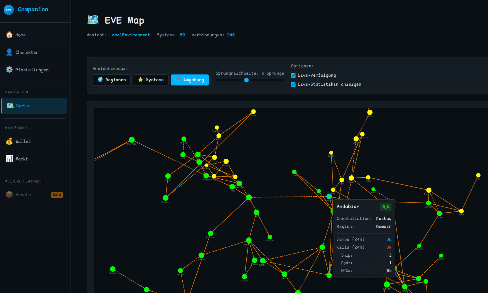

# WALL-EVE - EVE Online Companion App

**Eine umfassende Blazor-basierte Companion-Anwendung für EVE Online mit Wallet-Tracking, Transaktions-Analyse, Market-Integration und interaktiver Map-Visualisierung.**

---

## 📋 Inhalt / Table of Contents

- [Deutsch](#deutsch)
  - [Features](#features)
  - [Technologie-Stack](#technologie-stack)
  - [Einrichtung](#einrichtung)
  - [Map-Funktionen](#map-funktionen)
  - [Datenbanken](#datenbanken)
  - [Fehlerbehebung](#fehlerbehebung)
- [English](#english)
  - [Features](#features-1)
  - [Technology Stack](#technology-stack)
  - [Setup](#setup)
  - [Map Features](#map-features)
  - [Databases](#databases)
  - [Troubleshooting](#troubleshooting)

---



# Deutsch

## Features

### 💰 Wallet & Transactions
- **Wallet Journal & Transactions**: Vollständige Übersicht über alle ISK-Bewegungen
- **Tax-Linking**: Automatische Verknüpfung von Steuern mit Market-Transaktionen
- **Market Orders**: Integration von aktiven und historischen Market Orders
- **Transaction Persistence**: Wallet-Links werden lokal gespeichert für schnellere Ladezeiten

### 🗺️ Interaktive Map-Visualisierung
- **3 View-Modi**:
  - **Region View**: Alle Regionen des EVE Universe
  - **System View**: Detaillierte Ansicht einer einzelnen Region mit allen Systemen
  - **Local Environment**: Systeme innerhalb X Sprünge um die aktuelle Position

- **Live-Daten Integration**:
  - Dynamische Node-Größe basierend auf System-Aktivität (Kills + Jumps)
  - Roter Border für PvP-Aktivität (Ship Kills)
  - Echtzeit-Daten aus ESI (aktualisiert jede Stunde)

- **Erweiterte Visualisierung**:
  - **Constellation-Gruppierung**: Farbcodierte Verbindungen
    - 🟢 **Grün**: Intra-Constellation (eng verbundene Systeme)
    - 🔵 **Cyan**: Cross-Constellation (verschiedene Cluster, gleiche Region)
    - 🟠 **Orange (gestrichelt)**: Cross-Region (Region-Übergänge)
  - **Security Status**: Highsec (grün), Lowsec (gelb), Nullsec (rot)
  - **Character Tracking**: Live-Verfolgung der Charakter-Position
  - **Cross-Region Dummy-Nodes**: Virtuelle Nodes am Map-Rand für Region-Übergänge

### 🔧 Weitere Features
- **SDE Integration**: Nutzt EVE's Static Data Export für Item-Namen, Locations, etc.
- **Multi-Character Ready**: Vorbereitet für Multi-Character Support
- **ESI OAuth 2.0**: Sichere Authentifizierung via EVE SSO
- **ETag-Caching**: Effiziente ESI-Requests mit automatischem Caching

## Technologie-Stack

- **Backend**: .NET 10, Blazor Server
- **Frontend**: Blazor (Razor Components), HTML5, CSS3
- **Map-Rendering**: Cytoscape.js v3.30.2 (JavaScript Graph Library)
- **Datenbanken**: SQLite (SDE + App-Daten)
- **API**: EVE ESI (EVE Swagger Interface)
- **Authentication**: OAuth 2.0 PKCE Flow

## Einrichtung

### 1. Voraussetzungen

- **.NET 10 SDK** (oder höher)
- **EVE Online Developer Account**

### 2. EVE Developer Application erstellen

1. Gehe zu [EVE Online Developers](https://developers.eveonline.com/)
2. Erstelle eine neue Application:
   - **Name**: WALL-EVE (oder beliebig)
   - **Callback URL**: `http://localhost:5000/callback`
   - **Connection Type**: Authentication & API Access
   - **Scopes**: Wähle folgende Scopes:
     ```
     esi-characters.read_standings.v1
     esi-skills.read_skills.v1
     esi-skills.read_skillqueue.v1
     esi-wallet.read_character_wallet.v1
     esi-wallet.read_corporation_wallets.v1
     esi-location.read_location.v1
     esi-location.read_online.v1
     esi-location.read_ship_type.v1
     esi-markets.read_character_orders.v1
     ```
3. Kopiere die **Client ID**

### 3. Client ID eintragen

Öffne `appsettings.json` und ersetze die leere Client ID:

```json
{
  "EveOnline": {
    "ClientId": "deine-client-id-hier",
    ...
  }
}
```

### 4. Projekt starten

```bash
# Dependencies installieren
dotnet restore

# Projekt kompilieren
dotnet build

# Projekt starten
dotnet run
```

Öffne **http://localhost:5000** im Browser.

### 5. SDE (Static Data Export) herunterladen

Beim ersten Start wird die App die SDE automatisch herunterladen. Alternativ:

1. Gehe zu **Einstellungen** in der App
2. Klicke auf **"SDE herunterladen"**
3. Warte bis der Download abgeschlossen ist (~500 MB)

**Quelle**: https://www.fuzzwork.co.uk/dump/sqlite-latest.sqlite.bz2

## Map-Funktionen

### Koordinaten-Transformation

Die Map nutzt EVE's X/Z-Koordinaten aus der SDE:

```
EVE Universe (3D) → 2D Map Projection
X (Meter) → X (Pixel)
Z (Meter) → Y (Pixel)
Y (ignoriert)
```

**Algorithmus**:
1. Bounding Box berechnen (Min/Max der Koordinaten)
2. Normalisierung auf 0-1 Bereich
3. Skalierung auf Canvas-Größe (z.B. 3000x2400px)
4. Padding hinzufügen (15% Rand)

### Dynamisches Node-Styling

**Node-Größe** (basierend auf `TotalActivity = ShipKills + NpcKills + ShipJumps`):
```javascript
width = Math.min(40, 18 + Math.log10(totalActivity + 1) * 5)
```

Beispiele:
- 0 Activity → 18px (Basis)
- 100 Activity → ~28px
- 1000 Activity → ~33px (Durchgangs-System)
- 5000 Activity → ~36px (Jita)

**PvP-Border** (basierend auf `PvpActivity = ShipKills + PodKills`):
```javascript
border-width = 1 + Math.min(3, Math.log10(pvpActivity + 1))
border-color = pvpActivity > 0 ? '#ff0000' : '#888'
```

## Datenbanken

Die App verwendet zwei separate SQLite-Datenbanken in `~/.local/share/WALLEve/Data/`:

### `sde.sqlite` (Static Data Export)
- **Größe**: ~500 MB
- **Quelle**: EVE SDE (Fuzzwork Dump)
- **Inhalt**:
  - `mapRegions`, `mapConstellations`, `mapSolarSystems`
  - `mapSolarSystemJumps` (Stargate-Verbindungen)
  - `invTypes` (Item-Namen, Typen)
  - `staStations` (NPC-Stationen)
- **Updates**: Kann in den Einstellungen aktualisiert werden

### `wallet.db` (App-Daten)
- **Größe**: Klein (wächst mit Nutzung)
- **Inhalt**:
  - `WalletEntryLinks` (Steuer-Transaktions-Verknüpfungen)
  - `CharacterInfo` (Charakter-Metadaten)
- **Migrations**: Entity Framework Core (automatisch beim Start)

## Fehlerbehebung

### Token-Probleme
```bash
rm ~/.local/share/WALLEve/auth.dat
```
→ Logout + erneutes Login erforderlich

### Wallet-Links zurücksetzen
```bash
rm ~/.local/share/WALLEve/Data/wallet.db
```
→ Alle manuellen Verknüpfungen gehen verloren

### Map lädt nicht
1. Überprüfe Browser-Konsole (F12) auf JavaScript-Fehler
2. Stelle sicher, dass SDE heruntergeladen wurde
3. Checke ob ESI erreichbar ist: https://esi.evetech.net/latest/status/

### Build-Fehler
```bash
# Clean & Rebuild
dotnet clean
dotnet build
```

## Projektstruktur

```
WALL-Eve/
├── Components/          # Blazor Components
│   ├── Map/            # Map-Visualisierung (MapCanvas, MapControls)
│   └── Pages/          # Seiten (Index, Map, Wallet, etc.)
├── Models/             # Data Models
│   ├── Map/            # Map-Models (MapConnection, SystemActivity)
│   ├── Esi/            # ESI Response Models
│   └── Authentication/ # Auth Models
├── Services/           # Business Logic
│   ├── Map/            # Map-Services (MapDataService, RouteCalculation)
│   ├── Esi/            # ESI API Client
│   └── Sde/            # SDE Database Access
├── wwwroot/            # Static Assets
│   ├── js/             # JavaScript (cytoscape-map.js)
│   └── css/            # Stylesheets
└── Data/               # Runtime Data (auth.dat, *.db)
```

## 📄 Lizenz

Dieses Projekt ist unter der **MIT License** lizenziert - siehe die [LICENSE](LICENSE) Datei für Details.

**Was bedeutet das?**
- ✅ Du kannst den Code frei verwenden, modifizieren und verteilen
- ✅ Du kannst ihn kommerziell nutzen
- ✅ Behalte einfach den Copyright-Hinweis und Lizenztext bei
- ❌ Keine Garantie oder Haftung

**Third-Party Lizenzen**: Dieses Projekt verwendet verschiedene Open-Source-Bibliotheken - siehe [THIRD-PARTY-NOTICES.md](THIRD-PARTY-NOTICES.md) für Details.

**EVE Online Haftungsausschluss**: EVE Online und alle zugehörigen Logos und Designs sind Eigentum von CCP hf. Dieses Projekt ist nicht mit CCP Games verbunden oder von ihnen unterstützt.

---

# English

## Features

### 💰 Wallet & Transactions
- **Wallet Journal & Transactions**: Complete overview of all ISK movements
- **Tax-Linking**: Automatic linking of taxes with market transactions
- **Market Orders**: Integration of active and historical market orders
- **Transaction Persistence**: Wallet links are stored locally for faster load times

### 🗺️ Interactive Map Visualization
- **3 View Modes**:
  - **Region View**: All regions of the EVE Universe
  - **System View**: Detailed view of a single region with all systems
  - **Local Environment**: Systems within X jumps of current location

- **Live Data Integration**:
  - Dynamic node size based on system activity (Kills + Jumps)
  - Red border for PvP activity (Ship Kills)
  - Real-time data from ESI (updated hourly)

- **Advanced Visualization**:
  - **Constellation Grouping**: Color-coded connections
    - 🟢 **Green**: Intra-Constellation (tightly connected systems)
    - 🔵 **Cyan**: Cross-Constellation (different clusters, same region)
    - 🟠 **Orange (dashed)**: Cross-Region (region transitions)
  - **Security Status**: Highsec (green), Lowsec (yellow), Nullsec (red)
  - **Character Tracking**: Live tracking of character position
  - **Cross-Region Dummy-Nodes**: Virtual nodes at map edge for region transitions

### 🔧 Additional Features
- **SDE Integration**: Uses EVE's Static Data Export for item names, locations, etc.
- **Multi-Character Ready**: Prepared for multi-character support
- **ESI OAuth 2.0**: Secure authentication via EVE SSO
- **ETag-Caching**: Efficient ESI requests with automatic caching

## Technology Stack

- **Backend**: .NET 10, Blazor Server
- **Frontend**: Blazor (Razor Components), HTML5, CSS3
- **Map Rendering**: Cytoscape.js v3.30.2 (JavaScript Graph Library)
- **Databases**: SQLite (SDE + App Data)
- **API**: EVE ESI (EVE Swagger Interface)
- **Authentication**: OAuth 2.0 PKCE Flow

## Setup

### 1. Prerequisites

- **.NET 10 SDK** (or higher)
- **EVE Online Developer Account**

### 2. Create EVE Developer Application

1. Go to [EVE Online Developers](https://developers.eveonline.com/)
2. Create a new Application:
   - **Name**: WALL-EVE (or custom)
   - **Callback URL**: `http://localhost:5000/callback`
   - **Connection Type**: Authentication & API Access
   - **Scopes**: Select the following scopes:
     ```
     esi-characters.read_standings.v1
     esi-skills.read_skills.v1
     esi-skills.read_skillqueue.v1
     esi-wallet.read_character_wallet.v1
     esi-wallet.read_corporation_wallets.v1
     esi-location.read_location.v1
     esi-location.read_online.v1
     esi-location.read_ship_type.v1
     esi-markets.read_character_orders.v1
     ```
3. Copy the **Client ID**

### 3. Enter Client ID

Open `appsettings.json` and replace the empty Client ID:

```json
{
  "EveOnline": {
    "ClientId": "your-client-id-here",
    ...
  }
}
```

### 4. Start Project

```bash
# Install dependencies
dotnet restore

# Build project
dotnet build

# Start project
dotnet run
```

Open **http://localhost:5000** in your browser.

### 5. Download SDE (Static Data Export)

On first start, the app will automatically download the SDE. Alternatively:

1. Go to **Settings** in the app
2. Click **"Download SDE"**
3. Wait until download completes (~500 MB)

**Source**: https://www.fuzzwork.co.uk/dump/sqlite-latest.sqlite.bz2

## Map Features

### Coordinate Transformation

The map uses EVE's X/Z coordinates from SDE:

```
EVE Universe (3D) → 2D Map Projection
X (Meters) → X (Pixels)
Z (Meters) → Y (Pixels)
Y (ignored)
```

**Algorithm**:
1. Calculate bounding box (Min/Max of coordinates)
2. Normalize to 0-1 range
3. Scale to canvas size (e.g., 3000x2400px)
4. Add padding (15% margin)

### Dynamic Node Styling

**Node Size** (based on `TotalActivity = ShipKills + NpcKills + ShipJumps`):
```javascript
width = Math.min(40, 18 + Math.log10(totalActivity + 1) * 5)
```

Examples:
- 0 Activity → 18px (base)
- 100 Activity → ~28px
- 1000 Activity → ~33px (transit system)
- 5000 Activity → ~36px (Jita)

**PvP Border** (based on `PvpActivity = ShipKills + PodKills`):
```javascript
border-width = 1 + Math.min(3, Math.log10(pvpActivity + 1))
border-color = pvpActivity > 0 ? '#ff0000' : '#888'
```

## Databases

The app uses two separate SQLite databases in `~/.local/share/WALLEve/Data/`:

### `sde.sqlite` (Static Data Export)
- **Size**: ~500 MB
- **Source**: EVE SDE (Fuzzwork Dump)
- **Contents**:
  - `mapRegions`, `mapConstellations`, `mapSolarSystems`
  - `mapSolarSystemJumps` (Stargate connections)
  - `invTypes` (Item names, types)
  - `staStations` (NPC Stations)
- **Updates**: Can be updated in Settings

### `wallet.db` (App Data)
- **Size**: Small (grows with usage)
- **Contents**:
  - `WalletEntryLinks` (Tax-Transaction associations)
  - `CharacterInfo` (Character metadata)
- **Migrations**: Entity Framework Core (automatic on startup)

## Troubleshooting

### Token Issues
```bash
rm ~/.local/share/WALLEve/auth.dat
```
→ Logout + re-login required

### Reset Wallet Links
```bash
rm ~/.local/share/WALLEve/Data/wallet.db
```
→ All manual associations will be lost

### Map Not Loading
1. Check browser console (F12) for JavaScript errors
2. Ensure SDE has been downloaded
3. Verify ESI is reachable: https://esi.evetech.net/latest/status/

### Build Errors
```bash
# Clean & Rebuild
dotnet clean
dotnet build
```

## Project Structure

```
WALL-Eve/
├── Components/          # Blazor Components
│   ├── Map/            # Map Visualization (MapCanvas, MapControls)
│   └── Pages/          # Pages (Index, Map, Wallet, etc.)
├── Models/             # Data Models
│   ├── Map/            # Map Models (MapConnection, SystemActivity)
│   ├── Esi/            # ESI Response Models
│   └── Authentication/ # Auth Models
├── Services/           # Business Logic
│   ├── Map/            # Map Services (MapDataService, RouteCalculation)
│   ├── Esi/            # ESI API Client
│   └── Sde/            # SDE Database Access
├── wwwroot/            # Static Assets
│   ├── js/             # JavaScript (cytoscape-map.js)
│   └── css/            # Stylesheets
└── Data/               # Runtime Data (auth.dat, *.db)
```

---

## 📄 License

This project is licensed under the **MIT License** - see the [LICENSE](LICENSE) file for details.

**What does this mean?**
- ✅ You can use, modify, and distribute this code freely
- ✅ You can use it commercially
- ✅ Just keep the copyright notice and license text
- ❌ No warranty or liability

**Third-Party Licenses**: This project uses various open-source libraries - see [THIRD-PARTY-NOTICES.md](THIRD-PARTY-NOTICES.md) for details.

**EVE Online Disclaimer**: EVE Online and all associated logos and designs are the property of CCP hf. This project is not affiliated with or endorsed by CCP Games.

## 🔗 Links

- **EVE Online**: https://www.eveonline.com/
- **EVE Developers**: https://developers.eveonline.com/
- **ESI Documentation**: https://esi.evetech.net/ui/
- **Fuzzwork SDE**: https://www.fuzzwork.co.uk/dump/
- **Cytoscape.js**: https://js.cytoscape.org/

## 🙏 Credits

- **CCP Games** - EVE Online, ESI API, SDE
- **Fuzzwork** - SQLite SDE Dumps
- **Cytoscape.js** - Graph visualization library
