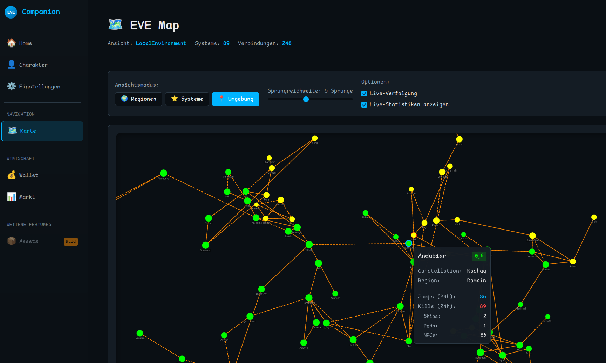

# WALL-EVE — EVE Online Economic Companion

**Lokale Blazor-Anwendung für Wallet, Bestand, Marktanalyse und Kartenansicht in EVE Online.**

**Local Blazor application for wallet, holdings, market analysis, and universe-map views in EVE Online.**



- [Deutsch](#deutsch)
- [English](#english)
- [Lizenz / License](#lizenz--license)

---

# Deutsch

## Status

WALL-EVE ist Alpha-Software. Wallet, Charakterwechsel, Marktansichten, Karte, Cost Basis und erste deterministische Bestandsanalysen sind implementiert. Mehrere bekannte Korrektheitsprobleme in Preis-, Bestands- und ESI-Fehlerlogik werden im Milestone **M0 — Data Trust** behoben. Bis dahin sind Cost-Basis- und Trading-Ergebnisse als vorläufig zu behandeln.

Verbindlicher Backlog:

- [GitHub Issues](https://github.com/yuriika/WALLEve/issues)
- [GitHub Milestones](https://github.com/yuriika/WALLEve/milestones)

## Funktionen

### Charakter und Anmeldung

- EVE Online OAuth 2.0 mit PKCE.
- Verschlüsselte lokale Token-Ablage.
- Mehrere gespeicherte Charaktere und Wechsel ohne erneute Anmeldung.
- Charakterübersicht mit Position, Schiff, Skills und Wallet-Daten, soweit die erteilten Scopes dies erlauben.

### Wallet und Transaktionen

- Wallet-Journal und Markttransaktionen.
- Filterbare Detailansichten.
- Verknüpfung von Transaktionen mit Steuer-, Escrow- und Order-Einträgen.
- Manuelle Bestätigung oder Ablehnung erkannter Verknüpfungen.
- Lokale Spiegelung von Wallet-Transaktionen für eine über das ESI-Fenster hinaus wachsende Historie.

### Markt und Orders

- Aktive und historische eigene Marktorders.
- Regionale Orderbücher und Markthistorie.
- Market Finder nach Item, aktueller Position, gewähltem System oder Region.
- Distanzfilter für Systeme innerhalb eines Sprungradius.
- Favoriten und automatisches Tracking wertvoller Bestands-Items.
- Eigene Orderposition, Unterbietungshinweise und Preisänderungssimulation.
- Änderungsgebühr, Break-even und Nettoauswirkung einer simulierten Preisänderung.

### Bestand und Cost Basis

- Charakterbestand mit Itemnamen, Mengen, Preisfeldern und Roh-Asset-Daten.
- Persistente Cost-Basis-Einträge aus Transaktionen, Schätzungen oder manuellen Werten.
- Hintergrundjobs für Transaktions-Sync, Ableitung, Schätzung und Komplett-Scan.
- Verkaufssimulator mit Erlös, Gebühren, Gewinn/Verlust und ROI.
- Erste deterministische Bestands-Verkaufshinweise.

> **Alpha-Hinweis:** Der aktuelle Bestand wird noch nach Itemtyp aggregiert und kann dabei mehrere Orte zusammenfassen. Die automatische Cost Basis ist noch kein vollständiges gleitendes Bestandsverfahren. Referenzpreise können nicht mit ausführbaren Orders gleichgesetzt werden. Diese Punkte sind im Data-Trust-Backlog erfasst.

### Interaktive Karte

- Regionen-, System- und lokale Umgebungsansicht.
- Aktuelle Charakterposition.
- Systeme innerhalb von X Sprüngen auf Basis des SDE-Stargategraphen.
- Aktivitätsanzeige aus ESI-Systemjumps und Kills.
- Security-Status und Regions-/Konstellationsverbindungen.

> Eine exakte Route mit sicherer/kurzer Wegwahl ist noch nicht implementiert. Der aktuelle Sprungradius ist keine Routenberechnung.

### Sync und lokale Daten

- ETag-basierter ESI-Cache.
- Begrenzte Parallelität und Backoff für paginierte ESI-Abfragen.
- Persistente Hintergrundjobs mit Fortschritt und Pause/Fortsetzen.
- Sync-Übersicht und manuelle Trigger auf der Charakterseite.
- Lokale SQLite-Datenbanken; kein zentraler WALL-EVE-Cloudspeicher.

### Trading-Architektur

Die vorhandenen Empfehlungen sind deterministisch berechnet. Ein lokaler LLM-Server ist für Wallet, Markt, Bestand und Trading-Berechnungen nicht erforderlich. Eine spätere LLM-Anbindung darf berechnete Ergebnisse erklären, aber keine Preise, Gebühren oder Gewinne erfinden.

Empfehlungen weisen ihre Herkunft ehrlich aus: Provenienz (deterministische Heuristik), Algorithmusversion, konkrete Berechnungs-Evidenz und Datenqualität statt einer erfundenen AI-Confidence. Alte Datensätze aus der Zeit der AI-Confidence werden als Legacy gekennzeichnet und nicht als aktuelle Evidenz gewertet.

ESI erlaubt WALL-EVE das Lesen von Markt- und Charakterdaten sowie begrenzte UI-Hilfen. WALL-EVE erstellt oder ändert keine Orders automatisch und steuert den EVE-Client nicht fern.

## Technologie

- .NET 10 / C# 14
- Blazor Interactive Server
- Entity Framework Core 10
- SQLite
- EVE ESI und EVE SDE
- Cytoscape.js
- xUnit

## Einrichtung

### Voraussetzungen

- .NET 10 SDK
- EVE Online Developer Application

### EVE-Anwendung

Erstelle unter [EVE Developers](https://developers.eveonline.com/) eine Anwendung mit:

```text
Callback URL: http://localhost:5080/callback
```

Für den aktuellen Funktionsumfang werden in der Projektkonfiguration unter anderem folgende Scopes dokumentiert:

```text
esi-characters.read_standings.v1
esi-skills.read_skills.v1
esi-skills.read_skillqueue.v1
esi-wallet.read_character_wallet.v1
esi-wallet.read_corporation_wallets.v1
esi-location.read_location.v1
esi-location.read_online.v1
esi-location.read_ship_type.v1
esi-markets.read_character_orders.v1
```

Trage die Client-ID in deiner lokalen `appsettings.json` ein. Zugangsdaten gehören nicht ins Repository.

### Start

```bash
dotnet restore
dotnet build
dotnet run
```

Öffne `http://localhost:5080`.

### SDE

Wenn `sde.sqlite` fehlt, lade die Fuzzwork-SQLite-Konvertierung in den WALL-EVE-Einstellungen herunter. Die Datei enthält unter anderem Items, Regionen, Systeme, Stationen und Stargateverbindungen.

## Lokale Daten

WALL-EVE verwendet im lokalen Anwendungsdatenordner:

- `wallet.db` — Wallet-, Markt-, Cost-Basis-, Favoriten- und Jobdaten;
- `sde.sqlite` — statische EVE-Daten;
- `auth.dat` — verschlüsselte Anmeldedaten mehrerer Charaktere.

Auf bestehenden macOS-Installationen wird auch folgender Pfad weiterverwendet:

```text
~/Library/Application Support/WALLEve/Data/
```

Datenbankänderungen werden beim Start über additive EF-Core-Migrationen angewendet.

## Entwicklung und Tests

```bash
dotnet test tests/WALLEve.Tests/WALLEve.Tests.csproj --no-restore
```

Vor jedem Commit und vor einem manuellen Nutzertest müssen die Tests grün sein. Architektur, Sync-Registry, bekannte Blocker und Entwicklungsregeln stehen in [`DEVELOPMENT.md`](DEVELOPMENT.md).

---

# English

## Status

WALL-EVE is alpha software. Wallet, character switching, market views, the map, cost basis, and initial deterministic inventory analysis are implemented. Several known correctness problems in pricing, holdings, and ESI failure handling are tracked in milestone **M0 — Data Trust**. Until they are fixed, cost-basis and trading results must be treated as provisional.

Authoritative backlog:

- [GitHub Issues](https://github.com/yuriika/WALLEve/issues)
- [GitHub Milestones](https://github.com/yuriika/WALLEve/milestones)

## Features

### Character and authentication

- EVE Online OAuth 2.0 with PKCE.
- Encrypted local token storage.
- Multiple remembered characters and switching without another login.
- Character overview with location, ship, skills, and wallet data where granted scopes permit it.

### Wallet and transactions

- Wallet journal and market transactions.
- Filterable detail views.
- Links between transactions and tax, escrow, and order entries.
- Manual approval or rejection of detected links.
- Local wallet-transaction mirror that grows beyond the ESI history window.

### Market and orders

- Active and historical personal market orders.
- Regional order books and market history.
- Market Finder by item, current position, selected system, or region.
- Distance filtering for systems within a jump radius.
- Favorites and automatic tracking of valuable inventory types.
- Own-order position, undercut hints, and price-change simulation.
- Modification fee, break-even, and net impact for a simulated price change.

### Holdings and cost basis

- Character inventory with item names, quantities, pricing fields, and raw asset data.
- Persistent cost-basis entries from transactions, estimates, or manual values.
- Background jobs for transaction sync, deduction, estimation, and full inventory scans.
- Sell simulator with proceeds, fees, profit/loss, and ROI.
- Initial deterministic inventory-sell suggestions.

> **Alpha warning:** The current inventory is still aggregated by item type and may combine multiple locations. Automatic cost basis is not yet a complete perpetual inventory-cost method. Reference prices must not be confused with executable orders. These items are tracked in the Data Trust backlog.

### Interactive map

- Region, system, and local-environment views.
- Current character position.
- Systems within X jumps using the SDE stargate graph.
- Activity display from ESI system jumps and kills.
- Security status and region/constellation connections.

> Exact safer/shorter route calculation is not implemented yet. The current jump radius is not a route calculation.

### Sync and local data

- ETag-based ESI cache.
- Bounded concurrency and backoff for paginated ESI requests.
- Persistent background jobs with progress and pause/resume.
- Sync overview and manual triggers on the character page.
- Local SQLite databases; no centralized WALL-EVE cloud storage.

### Trading architecture

Existing recommendations are calculated deterministically. A local LLM server is not required for wallet, market, holdings, or trading calculations. A future LLM integration may explain computed results but must not invent prices, fees, or profit.

Recommendations state their provenance honestly: provenance (deterministic heuristic), algorithm version, concrete calculation evidence, and data quality instead of an invented AI confidence. Older records from the AI-confidence era are flagged as legacy and not treated as current evidence.

ESI lets WALL-EVE read market and character data and provide limited UI helpers. WALL-EVE does not create or modify orders automatically and does not remotely control the EVE client.

## Technology

- .NET 10 / C# 14
- Blazor Interactive Server
- Entity Framework Core 10
- SQLite
- EVE ESI and EVE SDE
- Cytoscape.js
- xUnit

## Setup

### Requirements

- .NET 10 SDK
- EVE Online Developer Application

### EVE application

Create an application at [EVE Developers](https://developers.eveonline.com/) with:

```text
Callback URL: http://localhost:5080/callback
```

The project configuration currently documents the following scopes among those used by the application:

```text
esi-characters.read_standings.v1
esi-skills.read_skills.v1
esi-skills.read_skillqueue.v1
esi-wallet.read_character_wallet.v1
esi-wallet.read_corporation_wallets.v1
esi-location.read_location.v1
esi-location.read_online.v1
esi-location.read_ship_type.v1
esi-markets.read_character_orders.v1
```

Enter the client ID in your local `appsettings.json`. Credentials do not belong in the repository.

### Start

```bash
dotnet restore
dotnet build
dotnet run
```

Open `http://localhost:5080`.

### SDE

If `sde.sqlite` is missing, download the Fuzzwork SQLite conversion from WALL-EVE Settings. It contains items, regions, systems, stations, and stargate connections, among other static data.

## Local data

WALL-EVE uses the following files in the local application-data directory:

- `wallet.db` — wallet, market, cost-basis, favorites, and job data;
- `sde.sqlite` — static EVE data;
- `auth.dat` — encrypted credentials for remembered characters.

Existing macOS installations also continue to use:

```text
~/Library/Application Support/WALLEve/Data/
```

Database changes are applied at startup through additive EF Core migrations.

## Development and tests

```bash
dotnet test tests/WALLEve.Tests/WALLEve.Tests.csproj --no-restore
```

Tests must pass before every commit and before a manual user test. Architecture, sync registry, known blockers, and development rules are documented in [`DEVELOPMENT.md`](DEVELOPMENT.md).

---

# Lizenz / License

WALL-EVE is licensed under the [MIT License](LICENSE).

Third-party licenses are listed in [`THIRD-PARTY-NOTICES.md`](THIRD-PARTY-NOTICES.md).

EVE Online and all associated logos and designs are the property of CCP hf. WALL-EVE is not affiliated with or endorsed by CCP Games.

## Links

- [EVE Online](https://www.eveonline.com/)
- [EVE Developers](https://developers.eveonline.com/)
- [Fuzzwork SDE](https://www.fuzzwork.co.uk/dump/)
- [Cytoscape.js](https://js.cytoscape.org/)
